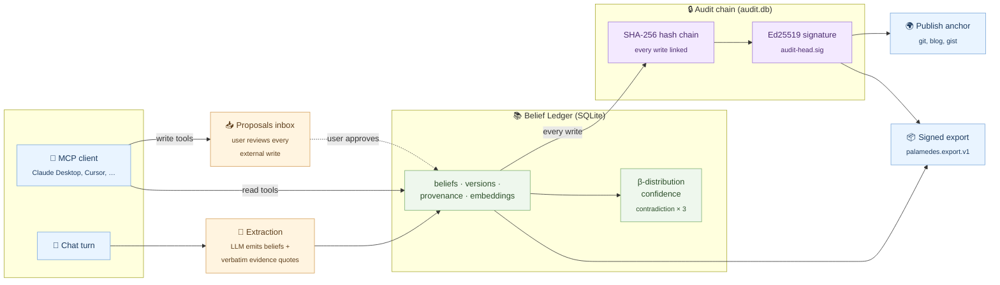

# Palamedes

**The AI that remembers what you've ruled out.**

Audit-grade, local-first AI memory: see what your AI believes about you, see
*why* it believes it, and correct it when it's wrong — so its advice stays
grounded in your real situation.

> **Status: pre-launch, dogfooding.** Public so the open Belief Schema MCP
> standard has a public reference implementation. Feature-complete enough to
> use day-to-day; the [Known limitations](#known-limitations) section is the
> live punch list. Formal launch a few weeks out.

## Why

Good advice needs your situation. Your AI keeps forgetting it — or remembering
it wrong, in a black box you can't inspect. You re-explain yourself every
session, you can't tell what it's sure of versus guessing, and when it's wrong
your only option is "delete everything and start over." And the more personal
the AI gets, the more it tends to just agree with you (personalization is the
single biggest driver of AI agreeableness — MIT, 2026).

Palamedes makes the AI's beliefs about you **first-class objects** you own:

- **Structural confidence** — how consistently a belief recurs across your
  conversations (never the model's self-rating, which is badly miscalibrated),
  shown as a coarse bucket, not a false-precise number.
- **Asserted vs. inferred** — "asserted" requires a verbatim quote from your own
  words, verified at extraction; everything else is inferred or hypothesized.
- **Provenance** — click any belief to the exact message it came from.
- **Version history** — every correction is preserved, not overwritten.
- **Ruled-out** — pin something wrong and it won't be re-inferred.

Corrections change the next answer, and travel to your other AI tools over MCP.

## Architecture



Every box is provable. Click a belief and you see the exact words it was
extracted from. Verify the chain and you re-derive every hash top to bottom.
Sign the head and you have a portable attestation no one else can forge.

## What's different

| | ChatGPT / Claude memory | Mem0 / OpenMemory | Palamedes |
|---|:--:|:--:|:--:|
| See every belief | summary only | plain text | yes |
| How sure it is (per belief) | – | – | yes |
| Asserted vs. inferred | – | – | yes |
| Why it believes it (source) | – | – | yes, click to source |
| Correct it — and it stays corrected | delete only | – | yes, governed |
| "Stop assuming X" (ruled-out) | – | – | yes |
| On your hard drive | – | self-host | yes |
| Portable across AI tools (MCP) | – | yes | yes |
| Published open schema | – | – | yes |

## Who it's for

People who use AI on decisions that compound: founders weighing pivots, hiring,
and where to focus; builders evaluating ideas, markets, and which company to
join or start; researchers and analysts tracking what they've explored versus
ruled out.

## The Belief Schema

The shape of an auditable, correctable memory — `{ statement, confidence,
status, trust_class, version, provenance[] }` — is the data primitive
Palamedes is built around. A standalone, language-neutral spec is in
preparation; for now the canonical reference is the Rust source under
`src-tauri/src/ledger.rs` and the SQLite schema in `src-tauri/schema.sql`.

## Audit chain

Every write to the belief ledger lands as a row in a tamper-evident
SHA-256 hash chain stored in a separate SQLite file (`audit.db` next to
`palamedes.db`). The chain is fully self-verifying — `audit_chain_verify`
walks it top-to-bottom and re-derives every hash; any in-place edit of
a past row falls out immediately.

On first launch Palamedes also generates a local Ed25519 keypair at
`<data_dir>/audit-key.{priv,pub}` (mode 0600). The `audit_chain_sign_head`
command signs the current head and writes `<data_dir>/audit-head.sig` —
that file is the portable attestation. Commit it to a public repo, email
it to yourself, or pin it anywhere outside the laptop, and you've
anchored the chain to a fixed external point. Export envelopes
(`export_ledger_signed`) carry the same signature, and
`import_ledger_verified` refuses any envelope whose signature doesn't
match the local pubkey.

Threat model: the keypair is local-only — a laptop attacker with full
disk access can both rewrite `audit.db` *and* re-sign with the key. The
value is portability: once the signed head leaves the laptop, it
becomes evidence a later audit can verify against.

## Known limitations

Audit-grade isn't a finished state — it's a thing you can verify, including
verifying what *isn't* yet covered. The honest list:

- **MCP consent is bucket-level today.** Granting a client read access lets
  it call every read tool; a per-category ACL (e.g. "preferences but not
  personal") is still on the roadmap. A per-client 1000-reads/24h rate
  limit plus a full audit log of every read are already in place; you can
  see exactly what each connected AI has fetched.
- **Embedding-model swaps require a re-embed pass.** If you change the
  embedding model, Palamedes detects it at startup, archives the old vectors
  to `vec_beliefs_legacy_<dim>` so you can roll back, and shows a banner. The
  background loop refills `vec_beliefs` at the new dim — semantic search
  degrades to empty until that completes.
- **The UMAP memory map runs client-side.** Fine up to roughly 10k beliefs;
  past that, the initial render gets sluggish. Worker-side projection and
  delta sync are still pending.
- **Confidence is recomputed on every fetch.** A single belief's confidence
  may change between two reads as reinforcement or recency drift — by
  design (it tracks the system's actual current state) but worth knowing.
- **Sycophancy is structurally resisted, not actively detected.** The
  ledger makes it harder for the AI to flip on a single agreeable response,
  but there's no per-turn "this answer is over-affirming" signal yet — that
  research-heavy work is post-launch.

If you find a limitation we haven't surfaced, file an issue.

## Providers — bring your own

Palamedes talks to any OpenAI-compatible HTTP endpoint. Pick a preset in
**Settings → Connections → LLM provider**, paste your key, restart:

| Provider | Base URL | What you get |
|---|---|---|
| **OpenAI (ChatGPT)** | `api.openai.com/v1` | GPT-4o, GPT-5 |
| **Anthropic (Claude)** | `api.anthropic.com/v1` | Claude 4.x (via Anthropic's OpenAI-compat adapter) |
| **Google (Gemini)** | `generativelanguage.googleapis.com/v1beta/openai` | Gemini (via Google's OpenAI-compat endpoint) |
| **OpenRouter** | `openrouter.ai/api/v1` | One key, ~200 models — Claude, GPT, Gemini, Llama, Mistral |
| **Groq** | `api.groq.com/openai/v1` | Llama, Mixtral, Qwen at very high tok/s |
| **Cerebras** | `api.cerebras.ai/v1` | Llama 3 at insane speeds |
| **Together** | `api.together.xyz/v1` | Llama 3/4, Mixtral, Qwen, DeepSeek |
| **Fireworks** | `api.fireworks.ai/inference/v1` | Llama 3, DeepSeek, Mixtral |
| **Nebius Token Factory** | `api.tokenfactory.nebius.com/v1` | Default — Kimi K2.5, Qwen3-Embedding-8B |
| **Ollama** (local) | `localhost:11434/v1` | Anything you've `ollama pull`ed — no key needed |
| **LM Studio** (local) | `localhost:1234/v1` | GUI for running open models locally |
| **Custom** | your endpoint | Anything OpenAI-compatible (vLLM, llama-cpp-python, …) |

Embeddings are pulled from the same endpoint, so any provider that ships
both chat + embeddings (most of the above) works out of the box. For
chat-only providers (Anthropic, Google) you can configure embeddings to
hit a different endpoint via the Custom row + the `embedding_model` setting.

## Stack

- **Shell**: Tauri 2 · **Frontend**: Svelte 5 + Vite + Tailwind
- **Backend**: Rust (in-process via Tauri commands) · **DB**: SQLite (`rusqlite`)
  + `sqlite-vec`
- **LLM**: provider-agnostic — any OpenAI-compatible endpoint (see above)
- **MCP**: in-process server exposing the audited corpus to Claude Desktop,
  Cursor, etc.

## Dev setup (NixOS)

```fish
direnv allow                     # or: nix develop
cp .env.example .env             # set LLM_API_KEY (or NEBIUS_API_KEY) and
                                 # optionally LLM_BASE_URL for first launch
pnpm install
cargo tauri dev
```

The provider config lives in the SQLite settings table after first launch
— the env vars are just bootstrap. Change provider any time from
Settings → Connections.

## Acknowledgments

Palamedes stands on a lot of other people's work. Where ideas were borrowed,
they're named here in case you want to follow the thread back.

**Prior art that shaped the design (clean-room — no code lifted):**

- **[SuperLocalMemory](https://github.com/Twinkle-Tickling/SuperLocalMemory)** —
  AGPL-3.0. The Bayesian Beta-distribution trust model for memory entries was
  the spark for our `confidence.rs`. Different implementation, same intuition:
  treat reinforcement and contradiction as evidence, not opinion.
- **[Memori](https://github.com/GibsonAI/memori)** — Apache-2.0. The
  "SQL-native, inspectable corpus" framing pushed us toward keeping everything
  in plain SQLite tables you can `jq` and `sqlite3` against, instead of an
  opaque vector store.
- **[Khoj](https://github.com/khoj-ai/khoj)** and **[Letta](https://github.com/letta-ai/letta)** —
  showed that local-first, user-owned memory is a real category, not a niche.

**Standards and protocols:**

- **[Model Context Protocol](https://modelcontextprotocol.io/)** (Anthropic) —
  the bus that lets Palamedes' Belief Ledger reach Claude Desktop, Cursor,
  Open WebUI, Witsy, and anything else that speaks MCP.
- **[rmcp](https://github.com/modelcontextprotocol/rust-sdk)** (Anthropic) —
  the official Rust SDK that backs our MCP server.

**Research:**

- **["Rewarding Doubt"](https://openreview.net/forum?id=v9bnpqjLZW)** (ICLR 2026)
  — the case for structural (not self-reported) confidence in language models.
  Our Beta(α, β) math is one concrete instantiation of that argument.
- **MIT 2026 personalization → sycophancy finding** — confirmed the failure
  mode the audit thesis is designed to make harder: an AI that quietly tracks
  the user's preferences and then quietly flatters them. A ledger you can
  inspect makes the flattery visible.

**Direct dependencies worth a specific nod:**

- **[sqlite-vec](https://github.com/asg017/sqlite-vec)** — the embeddings index
  that makes 4096-dim vectors usable inside a 5 MB sqlite file.
- **[ed25519-dalek](https://github.com/dalek-cryptography/curve25519-dalek)** —
  the signing primitive behind the audit chain attestation.
- **[Tauri](https://tauri.app/)**, **[Svelte](https://svelte.dev/)**,
  **[rusqlite](https://github.com/rusqlite/rusqlite)** — the desktop / UI /
  storage backbone.

If we missed your project and you think it should be here, open an issue.

---

Local-first and open source. Your data stays on your machine unless you connect
it. License: AGPL-3.0.
